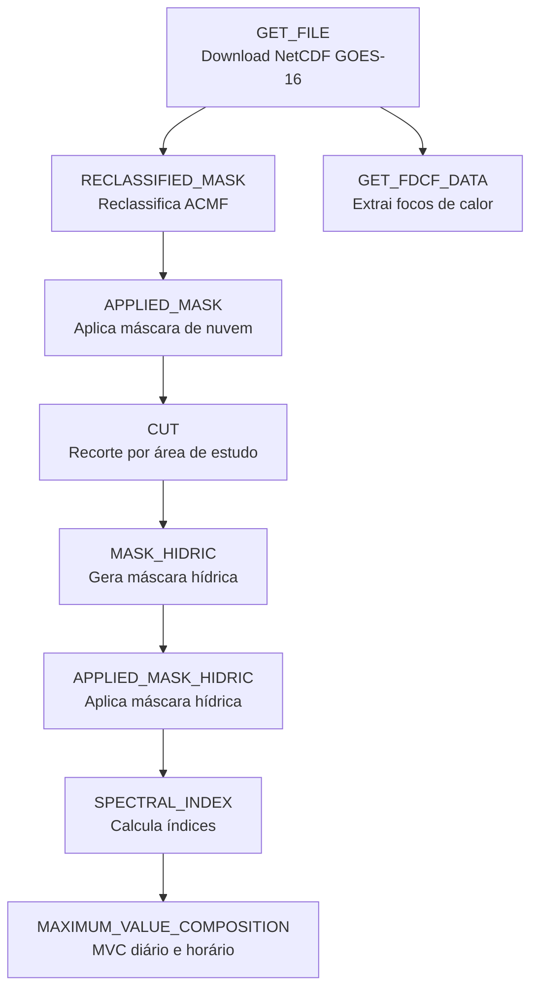

# CEPAGRI - Pipeline GOES-16 para Monitoramento Ambiental

<p align="center">
  
  
  
  
</p>

Pipeline de processamento de dados do **satélite GOES-16** para gerar produtos ambientais a partir de dados brutos NetCDF e entregar saídas analíticas como:

- rasters com máscara de nuvem e máscara hídrica aplicadas
- índices espectrais (NDVI, NBR, NDMI, EVI, SAVI, etc.)
- composições de máximo valor (MVC diário e horário)
- dados de focos de calor (FDCF) em CSV/Shapefile

---

## Visão Geral do Pipeline



---

## Objetivo do Projeto

Este repositório organiza um fluxo completo de **pré-processamento e análise de imagens GOES-16**, com foco em:

- reduzir ruído atmosférico e interferências (nuvens e água)
- padronizar dados em formatos geoespaciais prontos para SIG
- produzir indicadores espectrais para vegetação, umidade e queimadas
- facilitar análises temporais por meio de composições MVC
- apoiar monitoramento ambiental regional (ex.: Pantanal)

---

## Módulos Principais

| Etapa | Notebook | Ideia central | Saída principal |
|---|---|---|---|
| 1 | `GET_FILE.ipynb` | Busca e download de NetCDF no bucket NOAA S3 | Arquivos `.nc` por produto |
| 2 | `RECLASSIFIED_MASK.ipynb` | Reclassificação da máscara de nuvem (ACMF) | GeoTIFF máscara reclassificada |
| 3 | `APPLIED_MASK.ipynb` | Aplicação da máscara de nuvem sobre cenas CMIPF | GeoTIFF com nuvem mascarada |
| 4 | `CUT.ipynb` | Recorte espacial por shapefile da área de estudo | GeoTIFF recortado |
| 5 | `MASK_HIDRIC.ipynb` | Limiar NIR para separar água e não-água | GeoTIFF máscara hídrica |
| 6 | `APPLIED_MASK_HIDRIC.ipynb` | Remoção de água/nodata com máscara hídrica | Produto final mascarado |
| 7 | `SPECTRAL_INDEX.ipynb` | Cálculo de índices espectrais multi-banda | Pastas por índice com `.tif` |
| 8 | `MAXIMUM_VALUE_COMPOSITION.ipynb` | MVC diário e horário para cada índice | GeoTIFFs de composição |
| Extra | `GET_FDCF_DATA.ipynb` | Extração de focos de calor (FDCF) com filtro de qualidade | CSV, Shapefile e metadados JSON |

---

## Índices Espectrais Implementados

- **NDVI** - vigor/atividade da vegetação
- **NBR / NBR2** - sensibilidade a áreas queimadas e condição pós-fogo
- **NDMI** - umidade da vegetação
- **MIRBI** - índice focado em queimadas no infravermelho médio
- **EVI** - vegetação com menor saturação em alta biomassa
- **SAVI** - vegetação com ajuste para influência do solo

---

## Estrutura Sugerida de Pastas

```text
PROJETO/
├─ Dados/
│  ├─ ABI-L2-ACMF/netCDF/
│  ├─ ABI-L2-CMIPF/netCDF/
│  └─ ABI-L2-FDCF/netCDF/
├─ MASCARA_RECLASSIFICADA/
├─ MASCARA_APLICADA/
├─ CUT/
├─ MASCARA_HIDRICA/
├─ FINAL/
├─ Arquivos/
│  ├─ NDVI/ NBR/ NBR2/ NDMI/ MIRBI/ EVI/ SAVI/
│  └─ MVC_NDVI/ MVC_NBR/ ...
└─ NOTEBOOKS/Arquivos/
```

> Os nomes de pasta podem ser ajustados, mas manter um padrão consistente facilita automação e rastreabilidade.

---

## Ambiente e Dependências

O projeto oferece **duas formas oficiais** de configurar o ambiente:

- `environment.yml` (**recomendado**) para quem usa Conda/Miniconda
- `requirements.txt` para quem usa `pip` + `venv`

### Quando usar cada arquivo

- Use `environment.yml` quando quiser maior estabilidade em bibliotecas geoespaciais (GDAL/PROJ/GEOS).
- Use `requirements.txt` quando quiser um setup mais simples e rápido com `pip`.
- Não é necessário usar os dois ao mesmo tempo; escolha uma estratégia.

### Principais bibliotecas do pipeline
- `numpy`
- `rasterio`
- `xarray`
- `opencv-python`
- `geopandas`
- `shapely`
- `pyproj`
- `rioxarray`

### Acesso a dados e utilidades
- `s3fs` (acesso ao bucket público NOAA GOES-16)
- `pandas`
- `tqdm` (opcional para barra de progresso)

### Opção 1 — Instalação com Conda (recomendada)

```bash
conda env create -f environment.yml
conda activate cepagri-goes16
```

Para atualizar o ambiente após mudanças no arquivo:

```bash
conda env update -f environment.yml --prune
```

### Opção 2 — Instalação com pip (`requirements.txt`)

Crie e ative um ambiente virtual:

```bash
python -m venv .venv
```

Linux/macOS:

```bash
source .venv/bin/activate
```

Windows (PowerShell):

```bash
.venv\Scripts\Activate.ps1
```

Instale as dependências:

```bash
pip install -r requirements.txt
```

---

## Como Executar (Resumo)

1. **Baixar dados GOES-16** com `GET_FILE.ipynb`.
2. **Gerar e aplicar máscara de nuvem** (`RECLASSIFIED_MASK` -> `APPLIED_MASK`).
3. **Recortar área de estudo** com `CUT.ipynb`.
4. **Gerar e aplicar máscara hídrica** (`MASK_HIDRIC` -> `APPLIED_MASK_HIDRIC`).
5. **Calcular índices espectrais** com `SPECTRAL_INDEX.ipynb`.
6. **Gerar composições MVC** com `MAXIMUM_VALUE_COMPOSITION.ipynb`.
7. (Opcional) **Processar FDCF** para focos de calor com `GET_FDCF_DATA.ipynb`.

---

## Para Que Usar Este Pipeline?

Este pipeline é útil para:

- monitoramento de vegetação e estresse hídrico
- estudos de queimadas e severidade de fogo
- produção de séries temporais limpas para análise espacial
- geração de produtos geoespaciais para QGIS/ArcGIS
- suporte técnico a pesquisa aplicada e tomada de decisão ambiental

---

## Qualidade de Dados e Boas Práticas

- validar rapidamente cada etapa com poucos arquivos antes do lote completo
- manter convenção de nomes GOES-16 para garantir pareamento temporal automático
- checar alinhamento espacial (CRS/transform/dimensões) entre bandas
- monitorar `nodata` e propagação de `NaN` nas etapas de máscara
- registrar metadados de execução para reprodutibilidade

---

## Próximos Passos Recomendados

- fixar versões das dependências para maior reprodutibilidade entre máquinas
- criar script único de execução ponta a ponta (CLI)
- incluir testes automatizados para funções críticas
- publicar exemplos de visualização em QGIS e notebooks de validação

---

## Licença

Definir licença do projeto (ex.: MIT, BSD-3-Clause, GPL) antes da publicação final.

